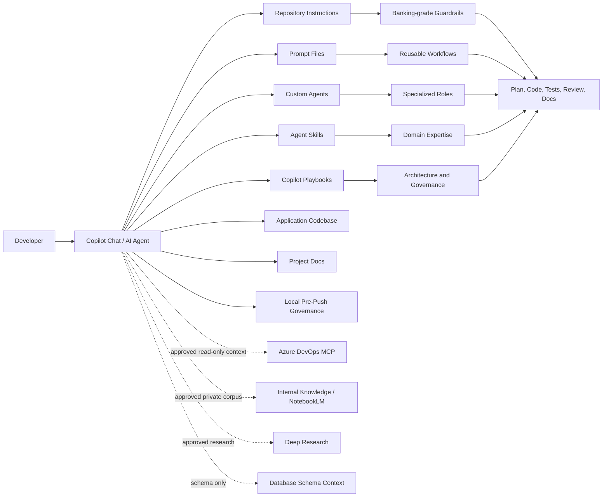
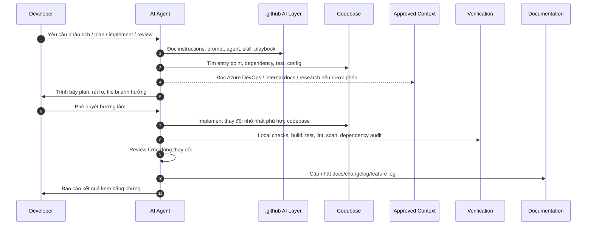
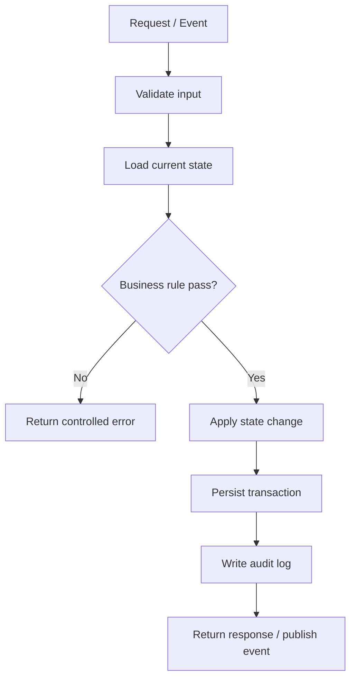
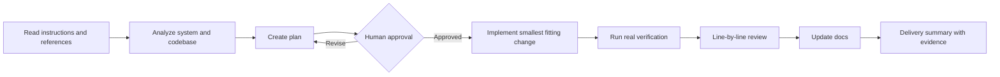

# Project AI Copilot Package - Developer Guide

Tài liệu này dành cho Developer mới bắt đầu dùng Project AI trong repository. Mục tiêu là biến bộ `.github` khá nhiều file thành một cách làm việc rõ ràng: đọc code nhanh hơn, lên kế hoạch chắc hơn, triển khai ít lệch kiến trúc hơn và review có bằng chứng.

> Phiên bản tài liệu: 2026-05-13  
> Phạm vi: `.github/copilot-instructions.md`, `.github/copilot`, `.github/prompts`, `.github/agents`, `.github/skills`, `.github/instructions`, `.github/hooks`, `.github/scripts`, `.github/docs`

## Mục lục

- [Tổng quan nhanh](#tổng-quan-nhanh)
- [Chương 1: Tầm nhìn và sức mạnh](#chương-1-tầm-nhìn-và-sức-mạnh)
  - [1.1 Vì sao AI Agent/LLM quan trọng với Developer?](#11-vì-sao-ai-agentllm-quan-trọng-với-developer)
  - [1.2 Giá trị thực tế của Project AI](#12-giá-trị-thực-tế-của-project-ai)
  - [1.3 Kiến trúc mục tiêu](#13-kiến-trúc-mục-tiêu)
  - [1.4 Luồng dữ liệu cấp cao](#14-luồng-dữ-liệu-cấp-cao)
  - [1.5 Bản đồ năng lực](#15-bản-đồ-năng-lực)
- [Chương 2: Hướng dẫn sử dụng chi tiết](#chương-2-hướng-dẫn-sử-dụng-chi-tiết)
  - [2.1 Quick start cho Developer mới](#21-quick-start-cho-developer-mới)
  - [2.2 Phân tích codebase](#22-phân-tích-codebase)
  - [2.3 Trace logic phức tạp](#23-trace-logic-phức-tạp)
  - [2.4 Workflow thực thi: Plan -> Implement -> Review](#24-workflow-thực-thi-plan---implement---review)
  - [2.5 Kết nối Azure DevOps qua MCP](#25-kết-nối-azure-devops-qua-mcp)
  - [2.6 NotebookLM cho tài liệu nội bộ](#26-notebooklm-cho-tài-liệu-nội-bộ)
  - [2.7 Deep Research cho R&D kiến trúc](#27-deep-research-cho-rd-kiến-trúc)
  - [2.8 Bảng lệnh thao tác nhanh](#28-bảng-lệnh-thao-tác-nhanh)
  - [2.9 Checklist an toàn cho dự án banking](#29-checklist-an-toàn-cho-dự-án-banking)

## Tổng quan nhanh

Project AI này không phải là một ứng dụng runtime. Đây là một **AI development operating layer** đặt trong `.github`, dùng để chuẩn hóa cách AI hỗ trợ Developer trong một dự án có yêu cầu kiểm soát cao.

| Thành phần | Số lượng | Vai trò |
| --- | ---: | --- |
| Repository instructions | 1 | Luật nền cho Copilot/AI khi làm việc trong repo |
| Copilot playbooks/catalogs | 20 | Kiến trúc, quy trình, catalog prompt/agent/skill và governance |
| Prompts | 22 | Lệnh thao tác nhanh cho phân tích, plan, implement, test, review, R&D |
| Agents | 11 | Vai trò chuyên biệt như System Analyst, Planner, Notebook Task Analyst, Tester, Security Reviewer |
| Skills | 18 | Bộ nguyên tắc chuyên sâu cho banking, testing, review, MCP, internal knowledge |
| Local governance | 2 | Pre-push warning hook/script cho package validation, secret scan và .NET checks khi có app code |
| Docs | 9 | Tài liệu vận hành, changelog, presentation, PDF export, hướng dẫn sử dụng |

Điểm quan trọng nhất: AI trong project này luôn đi theo hướng **reference-first, plan-first, evidence-first**. Nghĩa là AI phải đọc rule và code thật trước, lập kế hoạch trước khi sửa, rồi chứng minh bằng kiểm tra, review và tài liệu.

---

# Chương 1: Tầm nhìn và sức mạnh

## 1.1 Vì sao AI Agent/LLM quan trọng với Developer?

Với Developer, LLM mạnh nhất không nằm ở việc “viết code thật nhanh”, mà ở khả năng xử lý ngữ cảnh lớn:

- Đọc nhiều file cùng lúc và tóm tắt kiến trúc đang tồn tại.
- Trace một flow đi qua controller, service, repository, database, event, config và test.
- So sánh implementation mới với pattern cũ để tránh tạo ra một kiểu code lạ trong hệ thống.
- Tạo plan có ràng buộc về business rule, blast radius, rollback và kiểm thử.
- Review từng dòng thay đổi theo bảo mật, dữ liệu, logging, exception và backward compatibility.

Nói bình dân: AI Agent là một “đồng đội đọc repo rất nhanh”, nhưng trong dự án banking nó phải bị ràng buộc bằng quy trình. Project AI này chính là bộ ràng buộc đó.

## 1.2 Giá trị thực tế của Project AI

### Tăng tốc đọc code cũ

Khi nhận một module lạ, thay vì hỏi từng file rời rạc, Developer có thể dùng `/scout`, `/analyze-code`, `/explain-code` hoặc `@System Analyst` để AI lập bản đồ entry point, dependency, business rule và test hiện có.

Ví dụ:

```text
/analyze-code Hãy phân tích flow tạo hạn mức khách hàng.
Tập trung vào entry point, service chính, bảng dữ liệu, validation và test liên quan.
```

### Giảm rủi ro implement lệch kiến trúc

Project có skill `code-solution-fit`, `system-analysis`, `banking-grade-engineering`, `database-data-integrity` và prompt `/banking-plan`. Các phần này ép AI phải tìm pattern sẵn có trước khi đề xuất code mới.

Ví dụ:

```text
/banking-plan Cần thêm rule kiểm tra trạng thái hồ sơ trước khi cho phép submit.
Hãy đọc flow hiện tại, liệt kê file bị ảnh hưởng, rủi ro dữ liệu và test cần thêm.
```

### Review có bằng chứng

Sau khi sửa, flow chuẩn yêu cầu chạy verification thật của repo, review từng dòng thay đổi và cập nhật tài liệu. Điều này giúp giảm kiểu “AI nói đã ổn” nhưng không có build/test/lint/security đi kèm.

### Mở rộng context qua Azure DevOps, tài liệu nội bộ và R&D

Project đã có playbook cho:

- MCP kết nối `dev.azure.com` để đọc work item, repo, wiki, pipeline và search theo quyền tối thiểu.
- Internal knowledge theo kiểu NotebookLM để tra cứu coding convention, tài liệu kỹ thuật và bài học từ dự án cũ.
- Deep Research để so sánh thư viện, kiến trúc và tạo báo cáo R&D có nguồn rõ ràng.

## 1.3 Kiến trúc mục tiêu



Chú thích:

- **Repository Instructions** là luật nền, luôn được đọc trước.
- **Prompts** là lệnh thao tác nhanh cho từng việc cụ thể.
- **Agents** là vai trò chuyên môn hóa.
- **Skills** là bộ tiêu chuẩn chi tiết cho từng loại nhiệm vụ.
- **Playbooks** là tài liệu quy trình để AI làm việc có kiểm soát.
- **External Context** chỉ dùng theo hướng được phê duyệt, ưu tiên read-only và không đưa secrets vào prompt.

## 1.4 Luồng dữ liệu cấp cao



## 1.5 Bản đồ năng lực

| Năng lực | File/nhóm chính | Khi nào dùng |
| --- | --- | --- |
| Luật nền repository | `.github/copilot-instructions.md` | Mọi task |
| Đọc codebase | `/scout`, `/analyze-code`, `/explain-code`, `@System Analyst`, `codebase-reading` | Khi vào module lạ hoặc cần hiểu flow |
| Lên kế hoạch | `/plan`, `/banking-plan`, `@Planner`, `planning-governance` | Trước khi sửa code |
| Implement | `/implement`, `code-solution-fit`, `banking-grade-engineering` | Sau khi đã có plan |
| Debug | `/fix`, `@Debugger`, `root-cause-debugging` | Khi có bug hoặc test fail |
| Test/verification | `/test`, `@Tester`, `testing-verification`, `dotnet-testing`, local pre-push governance | Trước khi bàn giao hoặc trước khi push |
| Review | `/review`, `/line-review`, `@Code Reviewer`, `@Security Reviewer` | Sau mỗi thay đổi |
| Docs | `/docs-update`, `/docs-base-update`, `@Docs Manager` | Khi feature/flow thay đổi |
| Azure DevOps MCP | `/azure-devops-intake`, `/mcp`, `mcp-integration-governance` | Khi cần đọc work item, wiki, pipeline, repo metadata |
| Internal knowledge | `/internal-knowledge`, `@Knowledge Curator`, `@Notebook Task Analyst`, `internal-knowledge-governance` | Khi cần hỏi tài liệu nội bộ, bug cũ, hoặc chuyển NotebookLM brief thành phân tích task |
| Deep Research | `/deep-research`, `/architecture-research`, `@Research Architect` | Khi cần so sánh thư viện/kiến trúc |

---

# Chương 2: Hướng dẫn sử dụng chi tiết

## 2.1 Quick start cho Developer mới

Mục tiêu của quick start là giúp bạn hiểu repo trong 10-15 phút đầu mà không bị ngợp.

### Bước 1: Đọc bản đồ project

```text
/scout Hãy tóm tắt cấu trúc repo, entry point chính, test project, config quan trọng và các tài liệu cần đọc trước.
```

Kỳ vọng output:

- Cây thư mục cấp cao.
- Module chính và vai trò của từng module.
- Những file cần đọc trước.
- Vùng rủi ro cao như auth, dữ liệu, transaction, logging, config.

### Bước 2: Phân tích flow bạn đang được giao

```text
/analyze-code Hãy phân tích flow <tên flow>.
Liệt kê entry point, lớp xử lý chính, data contract, validation, side effect, test hiện có và điểm cần cẩn thận.
```

### Bước 3: Lên plan trước khi sửa

```text
/banking-plan Tôi cần thay đổi <mô tả yêu cầu>.
Hãy đề xuất plan nhỏ nhất, file bị ảnh hưởng, test cần chạy, rủi ro dữ liệu và điều kiện rollback.
```

### Bước 4: Implement sau khi plan đã rõ

```text
/implement Thực hiện theo plan đã thống nhất.
Giữ thay đổi nhỏ, bám pattern hiện có, không đổi public contract nếu không cần.
```

### Bước 5: Verify và review

```text
/test Chạy verification thật của repo và giải thích kết quả.
/line-review Review từng dòng thay đổi, tập trung vào banking safety, security, dữ liệu, logging và backward compatibility.
/docs-base-update Cập nhật tài liệu dự án dựa trên thay đổi vừa thực hiện.
```

### Bật cảnh báo trước khi push

Chạy một lần trong mỗi clone:

```powershell
git config core.hooksPath .github/hooks
```

Từ lúc đó, mỗi lần `git push`, hook `.github/hooks/pre-push` sẽ gọi `.github/scripts/pre-push-governance-check.ps1` ở chế độ warning. Nếu có lỗi, hook in cảnh báo nhưng vẫn cho push. Muốn chặn push ở máy local thì chạy strict mode:

```powershell
.github\scripts\pre-push-governance-check.ps1 -Mode Strict
```

## 2.2 Phân tích codebase

Khi gặp code cũ, đừng bắt đầu bằng câu “file này làm gì?”. Hãy yêu cầu AI dựng bản đồ từ ngoài vào trong.

### Cách hỏi tốt

```text
/analyze-code Phân tích module quản lý hồ sơ khách hàng.
Hãy đi theo thứ tự:
1. Entry point
2. Request/response contract
3. Service orchestration
4. Repository/database access
5. Business rules
6. Error handling/logging
7. Tests và lỗ hổng test
```

### Cách đọc output

Bạn nên kiểm tra AI có trả lời đủ các phần này không:

- **Entry point**: API, command handler, scheduled job, message consumer hoặc function chính.
- **Layer path**: đường đi qua controller/handler -> service -> repository -> external dependency.
- **Data contract**: DTO, entity, enum, validation rule.
- **Business rule**: điều kiện nghiệp vụ thật, không chỉ mô tả code.
- **Side effect**: ghi DB, publish event, gọi service khác, ghi audit log.
- **Test gap**: chỗ chưa có test hoặc test chưa bao phủ rule quan trọng.

### Prompt mẫu cho tóm tắt folder

```text
/scout Hãy tóm tắt folder <path>.
Nêu vai trò từng nhóm file, luồng phụ thuộc, file nào nên đọc đầu tiên và file nào có rủi ro cao.
```

## 2.3 Trace logic phức tạp

Trace logic là việc đi theo một request hoặc event từ lúc vào hệ thống tới khi kết thúc. Với banking, trace nên luôn đi kèm dữ liệu và rule.

### Prompt trace flow

```text
/explain-code Trace flow <tên flow hoặc endpoint>.
Hãy mô tả từng bước theo thứ tự runtime, kèm file/function, dữ liệu đi qua, validation, exception, transaction và audit/log.
```

### Prompt kiểm tra logic

```text
/logic-check Kiểm tra logic của flow <tên flow>.
Tìm nhánh điều kiện thiếu, rule mâu thuẫn, lỗi null/boundary, race condition, sai transaction hoặc logging nhạy cảm.
```

### Sơ đồ trace nên yêu cầu AI tạo



Mẹo thực tế: nếu AI bỏ qua database, audit log hoặc transaction, hãy yêu cầu trace lại. Đó thường là nơi bug khó và rủi ro compliance xuất hiện.

## 2.4 Workflow thực thi: Plan -> Implement -> Review

Workflow chuẩn của project:



### Step-by-step

1. **Plan**

```text
/banking-plan <yêu cầu>
```

Yêu cầu AI nêu rõ:

- File sẽ sửa.
- File sẽ không sửa.
- Business rule liên quan.
- Rủi ro dữ liệu.
- Test/verification cụ thể.
- Cần approval ở điểm nào.

2. **Implement**

```text
/implement Làm theo plan đã duyệt.
Không mở rộng scope, không refactor ngoài yêu cầu, không thay đổi contract nếu chưa được phê duyệt.
```

3. **Test**

```text
/test Chạy verification thật của repo.
Nếu repo có .NET, ưu tiên dotnet restore/build/test/format theo hướng dẫn hiện có.
Nếu không có stack runtime trong repo hiện tại, chạy các command governance phù hợp với .github.
```

4. **Review**

```text
/line-review Review toàn bộ diff.
Tập trung vào security, data integrity, exception, logging, audit, performance và backward compatibility.
```

5. **Docs**

```text
/docs-base-update Cập nhật docs, changelog và feature-delivery-log cho thay đổi vừa thực hiện.
```

## 2.5 Kết nối Azure DevOps qua MCP

Project này dùng `dev.azure.com` làm nguồn work item chính.

MCP giúp AI đọc ngữ cảnh công việc từ hệ thống quản lý nội bộ, ví dụ work item, acceptance criteria, wiki kỹ thuật, repository metadata hoặc pipeline status.

### Luồng dùng khuyến nghị

```text
/azure-devops-intake <Azure DevOps work item URL hoặc ID>
Hãy đọc requirement, acceptance criteria, linked items, wiki liên quan và đề xuất code structure phù hợp với repo hiện tại.
```

Sau đó:

```text
/banking-plan Dựa trên work item Azure DevOps vừa đọc, lập plan implement theo pattern hiện có.
```

### Nguyên tắc an toàn

- Mặc định read-only.
- Chỉ đọc dữ liệu cần cho task.
- Không xuất raw log, secret, token, thông tin khách hàng hoặc dữ liệu nhạy cảm vào prompt.
- Không tự sửa work item, trigger pipeline hoặc thay đổi repo từ MCP nếu chưa được phê duyệt rõ.
- Khi requirement mơ hồ, AI phải ghi assumption và hỏi lại thay vì tự đoán nghiệp vụ.

## 2.6 NotebookLM cho tài liệu nội bộ

NotebookLM trong bối cảnh project này được hiểu là một kho tri thức riêng tư: coding convention, tài liệu kiến trúc, ADR, incident report, bài học từ dự án cũ và hướng dẫn onboarding.

### Khi nào dùng

- Nhân viên mới cần hỏi “module này trước đây thiết kế vì sao?”.
- Cần tìm lại cách xử lý một bug cũ.
- Cần đối chiếu convention nội bộ trước khi viết code.
- Cần hiểu một quyết định kiến trúc đã có trong quá khứ.

### Prompt mẫu

```text
/internal-knowledge Tìm trong tài liệu nội bộ các convention liên quan đến transaction, audit log và exception handling.
Tóm tắt rule áp dụng cho task hiện tại, kèm nguồn tài liệu và mức độ chắc chắn.
```

### Cách dùng output

AI nên trả lời theo 3 phần:

- **Kết luận áp dụng ngay**: rule nào cần tuân thủ.
- **Nguồn nội bộ**: tài liệu, ADR hoặc guideline nào được dùng.
- **Điểm chưa chắc**: phần nào cần human confirm.

### Agent chuyên cho task nhiều tài liệu

Khi task có nhiều file spec, AC, guideline, ADR hoặc bug history đã được gom trong NotebookLM, dùng `@Notebook Task Analyst` trước `@Planner`.

Prompt mẫu:

```text
@Notebook Task Analyst
Đây là Task Brief từ NotebookLM, có citation theo tài liệu nội bộ:
[paste brief + source citations]

Hãy kiểm tra source hygiene, tách fact/assumption, đọc codebase thật,
map requirement vào file/function/test hiện có, nêu gap và tạo planner handoff.
Chưa implement.
```

Sau đó dùng:

```text
/banking-plan
Use the Notebook Task Analyst handoff and create a smallest-safe implementation plan.
```

## 2.7 Deep Research cho R&D kiến trúc

Deep Research dùng khi team cần một báo cáo có nguồn về thư viện, framework hoặc hướng kiến trúc.

Ví dụ phù hợp:

- So sánh monolith modular và microservices cho một domain mới.
- Chọn thư viện background job.
- So sánh performance/cost của các cách cache.
- Đánh giá rủi ro khi nâng version framework.

### Prompt mẫu

```text
/architecture-research So sánh modular monolith và microservices cho hệ thống xử lý hồ sơ khách hàng.
Bối cảnh: team nhỏ, yêu cầu audit cao, release theo sprint, cần giảm rủi ro vận hành.
Xuất báo cáo gồm tiêu chí, bảng so sánh, khuyến nghị, rủi ro và bước thử nghiệm.
```

### Output tốt cần có

- Tiêu chí so sánh rõ ràng.
- Nguồn chính thống hoặc đáng tin cậy.
- Bảng trade-off.
- Khuyến nghị gắn với bối cảnh repo.
- Rủi ro và cách kiểm chứng bằng spike/POC.

Lưu ý: Deep Research chỉ tạo khuyến nghị. Quyết định kiến trúc vẫn cần review của Tech Lead/Architect và ghi thành ADR nếu được chấp nhận.

## 2.8 Bảng lệnh thao tác nhanh

| Mục tiêu | Lệnh/prompt | Output mong muốn |
| --- | --- | --- |
| Hiểu nhanh repo | `/scout` | Folder map, entry point, docs/test/config cần đọc |
| Phân tích flow | `/analyze-code` | Layer path, business rule, side effect, test gap |
| Giải thích code | `/explain-code` | Diễn giải dễ hiểu theo runtime |
| Kiểm tra logic | `/logic-check` | Nhánh thiếu, bug boundary, transaction/logging risk |
| Lập kế hoạch | `/plan` | Plan kỹ thuật thông thường |
| Lập kế hoạch banking | `/banking-plan` | Plan có compliance, data integrity, rollback |
| Implement | `/implement` | Code change nhỏ, hợp pattern |
| Debug | `/fix` | Root cause, patch, regression test |
| Test | `/test` hoặc `.github\scripts\pre-push-governance-check.ps1 -Mode Warn` | Verification thật và kết quả |
| Review | `/review` | Review cấp PR/change |
| Review từng dòng | `/line-review` | Finding theo file/dòng, mức độ rủi ro |
| Cập nhật docs | `/docs-update` | Tài liệu feature/flow |
| Cập nhật docs base | `/docs-base-update` | Changelog, docs base, delivery log |
| Đọc Azure DevOps | `/azure-devops-intake` | Requirement, acceptance criteria, linked context |
| Dùng MCP | `/mcp` | Context từ tool được phê duyệt |
| Hỏi tài liệu nội bộ | `/internal-knowledge` | Câu trả lời dựa trên private docs |
| Nghiên cứu chuyên sâu | `/deep-research` | Báo cáo R&D có nguồn |
| Nghiên cứu kiến trúc | `/architecture-research` | So sánh kiến trúc/thư viện và khuyến nghị |
| Vòng dev đầy đủ | `/devloop` | Plan -> implement -> verify -> review -> docs |

## 2.9 Checklist an toàn cho dự án banking

Trước khi chấp nhận output của AI, hãy kiểm tra:

- AI đã đọc `.github/copilot-instructions.md` và playbook liên quan chưa?
- AI có nêu file thật, function thật, test thật không?
- Plan có ghi rõ business rule và data integrity không?
- Có thay đổi public API/contract/schema không? Nếu có, đã có approval chưa?
- Có xử lý logging để không lộ dữ liệu nhạy cảm không?
- Có transaction/idempotency/concurrency risk không?
- Có test cho happy path, negative path và boundary không?
- Verification command có chạy thật không?
- Review có chỉ ra file/dòng cụ thể không?
- Docs/changelog/feature log đã cập nhật chưa?

## Kết luận

Project AI này là một bộ khung để Developer dùng AI một cách có kiểm soát. Điểm mạnh của nó không chỉ nằm ở prompt hay agent riêng lẻ, mà ở cách kết hợp nhiều lớp: instructions đặt luật, playbook đặt quy trình, prompt tạo thao tác nhanh, agent chia vai, skill thêm chuyên môn, workflow tạo bằng chứng và docs giữ tri thức sống.

Với cách dùng đúng, AI không thay Developer ra quyết định nghiệp vụ. AI giúp Developer nhìn hệ thống nhanh hơn, đặt câu hỏi tốt hơn, triển khai gọn hơn và review chắc hơn.
