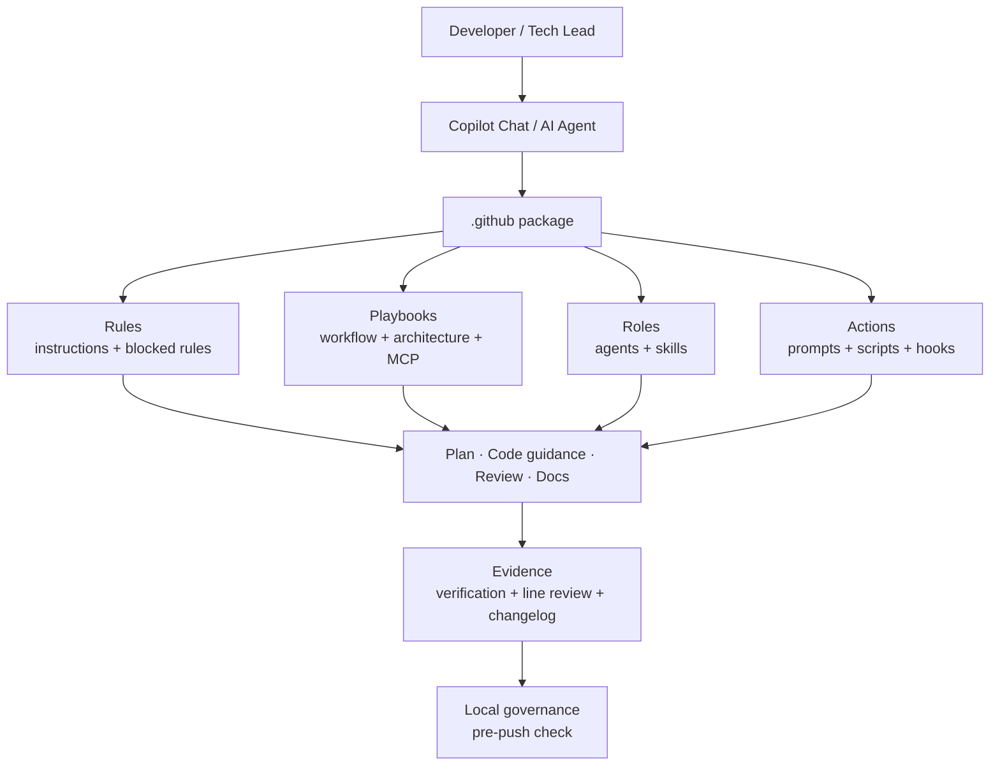
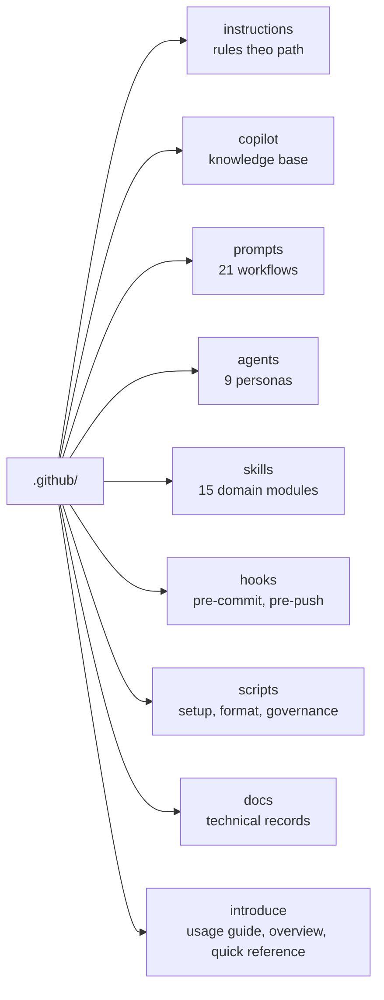
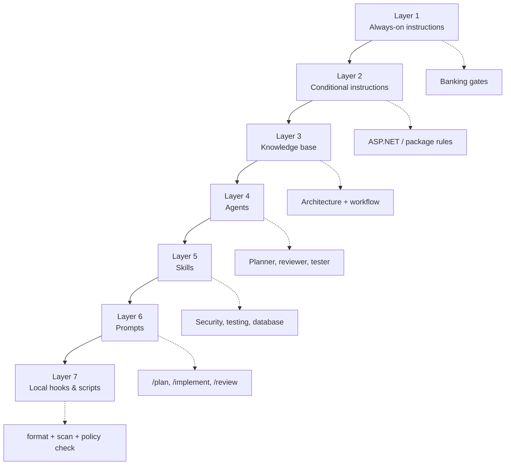
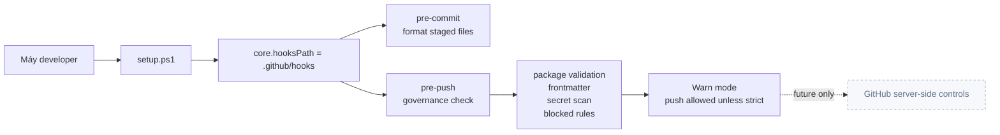
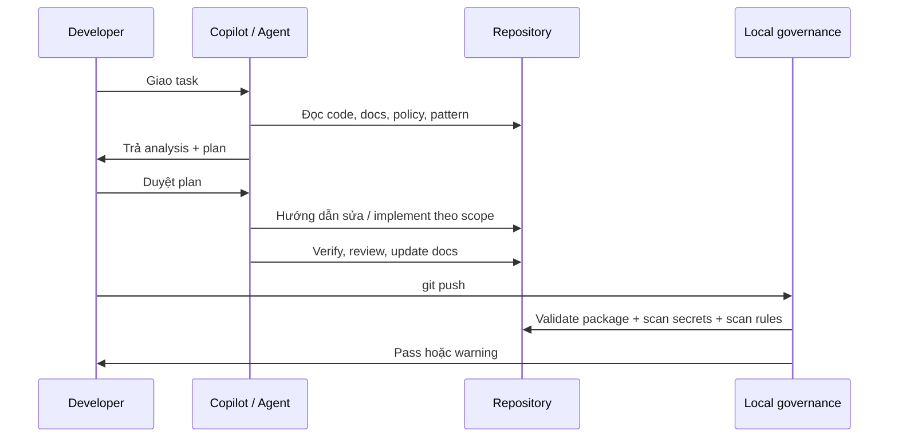
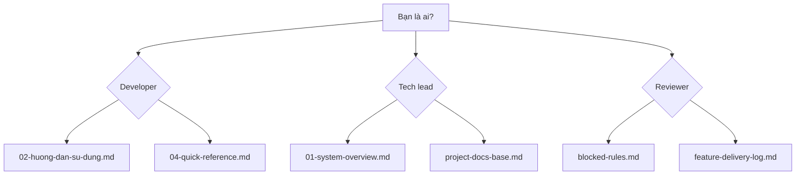

# System overview

Project AI là một **AI development operating layer** nằm trong `.github/`. Nó không phải chatbot service, không phải model gateway, không phải runtime backend. Nó là bộ luật, workflow, prompt, agent, skill, docs và local hook để Copilot làm việc như một đồng đội kỹ thuật có kỷ luật.

## Big picture

Một câu để nhớ:

> Project AI biến Copilot từ công cụ trả lời thành một quy trình làm việc: đọc trước, plan trước, kiểm chứng trước.

## Package map

## Tầng kiến trúc

## Local-only boundary

Hiện tại hệ thống chỉ dừng ở **local governance**. Đây là chủ ý thiết kế cho giai đoạn này.

Không thêm trong giai đoạn hiện tại:

- PR template.
- CODEOWNERS.
- Branch protection.
- GitHub Actions.
- CI/CD enforcement.

## Luồng delivery chuẩn

## Hệ thống bảo vệ điều gì

| Rủi ro                       | Cách package giảm rủi ro                                       |
| ---------------------------- | -------------------------------------------------------------- |
| AI sửa code không hiểu flow  | Bắt đọc context, trace flow, phân tích blast radius            |
| AI tạo pattern mới lung tung | Component-first, blocked rules, centralized DI/config guidance |
| AI bỏ qua security/privacy   | Banking gates, secure review, secret scan, blocked data rules  |
| AI nói xong nhưng không test | Evidence-required, testing-verification skill, delivery log    |
| Docs bị lệch implementation  | Docs base, changelog, feature delivery log                     |

## Đọc theo vai trò

## Thành phần chính

| Thành phần                                      | Vai trò                                |
| ----------------------------------------------- | -------------------------------------- |
| `.github/copilot-instructions.md`               | Luật nền always-on                     |
| `.github/copilot/blocked-rules.md`              | Rule cấm trung tâm                     |
| `.github/copilot/*.md`                          | Playbook, catalog, assessment          |
| `.github/prompts/*.prompt.md`                   | Slash-command workflows                |
| `.github/agents/*.agent.md`                     | Persona chuyên biệt                    |
| `.github/skills/*/SKILL.md`                     | Năng lực domain                        |
| `.github/scripts/setup.ps1`                     | Cài local hook và kiểm tra package     |
| `.github/scripts/pre-push-governance-check.ps1` | Local governance check                 |
| `.github/docs/`                                 | Technical records                      |
| `.github/introduce/`                            | Usage guide, overview, quick reference |

## Điều package này không làm

- Không thay thế human reviewer.
- Không đọc external source nếu chưa được phê duyệt.
- Không chứa production model, dataset, eval harness hoặc telemetry.
- Không thay server-side governance khi sau này team cần hard gate.
- Không cho phép secret, token, PII, account data, card data hoặc production data đi vào prompt, test, docs hay log.
