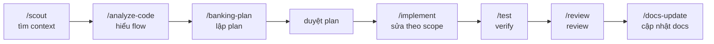
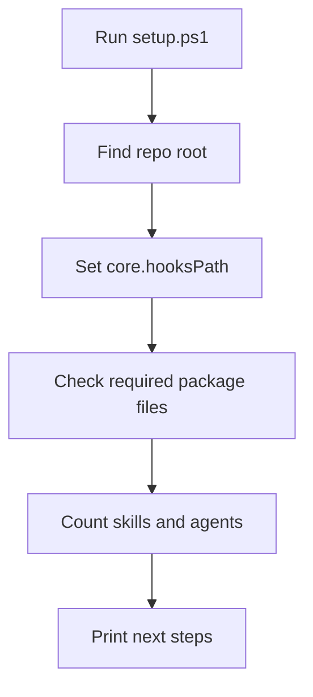
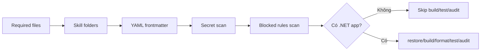
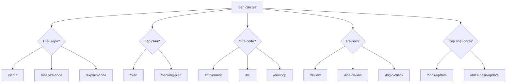
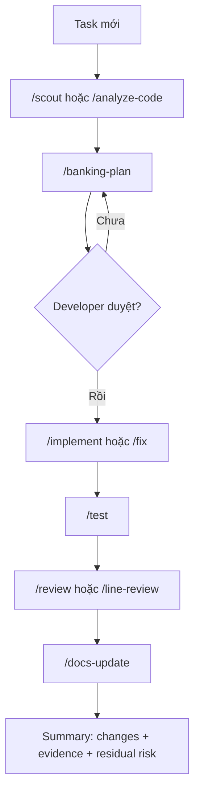
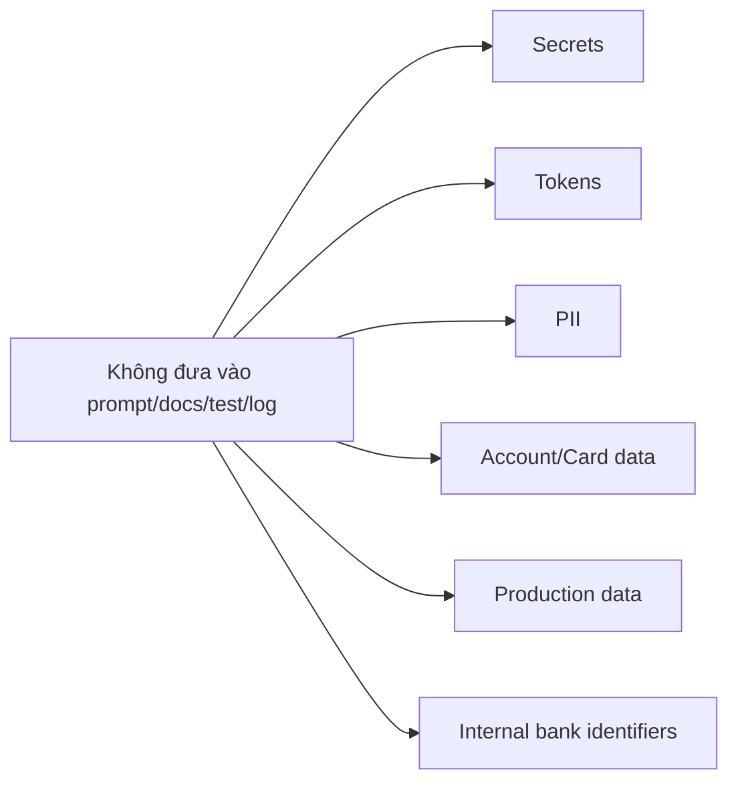

# Hướng dẫn sử dụng

Tài liệu này dành cho developer dùng Project AI hằng ngày. Đọc xong bạn phải biết ba việc: bật local hook, hỏi AI đúng cách, và biết lúc nào cần plan/verify/docs.

## TL;DR

```powershell
.github\scripts\setup.ps1
.github\scripts\pre-push-governance-check.ps1 -Mode Warn
```

Sau đó dùng AI theo nhịp:



## Bước 1 - Cài local hook

Chạy một lần sau khi clone:

```powershell
.github\scripts\setup.ps1
```

Script sẽ:



Nếu muốn local hook chặn push khi governance fail:

```powershell
.github\scripts\setup.ps1 -Strict
```

Giai đoạn hiện tại ưu tiên `Warn` mode, nên `-Strict` là tùy chọn.

## Bước 2 - Kiểm tra package

Chạy:

```powershell
.github\scripts\pre-push-governance-check.ps1 -Mode Warn
```

Governance check đi qua các trạm:



Kết quả tốt:

- Required package files: OK.
- Skill folders: OK.
- YAML frontmatter: OK.
- Secret scan: OK.
- Banking policy scan: OK.

## Bước 3 - Chọn prompt theo tình huống



## Bước 4 - Chọn agent theo vai

| Tình huống                 | Agent nên dùng       |
| -------------------------- | -------------------- |
| Chưa hiểu module           | `system-analyst`     |
| Cần kế hoạch rõ scope/risk | `planner`            |
| Cần tìm file hoặc context  | `researcher`         |
| Test fail hoặc cần verify  | `tester`             |
| Bug khó trace              | `debugger`           |
| Review chất lượng code     | `code-reviewer`      |
| Review security/privacy    | `security-reviewer`  |
| Cập nhật docs              | `docs-manager`       |
| Nghiên cứu kiến trúc       | `research-architect` |

## Prompt mẫu dùng ngay

### Phân tích flow

```text
/analyze-code Hãy đọc flow hiện tại, liệt kê entry point, service, repository, data contract, integration, side effect, test và blast radius.
```

### Lập plan banking-grade

```text
/banking-plan Tôi cần thay đổi rule xử lý nghiệp vụ. Hãy lập plan gồm scope, affected files, security/privacy risk, data impact, rollback, verification và docs impact. Không implement trước khi tôi duyệt.
```

### Review sau thay đổi

```text
/line-review Review từng dòng thay đổi. Ưu tiên correctness, security, privacy, logging, data integrity, exception handling, missing tests và docs impact.
```

### Cập nhật docs

```text
/docs-base-update Cập nhật project-docs-base, project-changelog và feature-delivery-log. Ghi rõ verification, rollback và residual risk.
```

## Luồng một task chuẩn



## Rule an toàn



Ngoài ra:

- Không tạo helper, serializer, DI/config pattern, logging wrapper hoặc dependency mới trước khi tìm component sẵn có.
- Không trả stack trace, connection string, SQL text hoặc downstream raw payload cho client.
- Không claim done nếu chưa có verification hoặc chưa nói rõ check nào chưa chạy.
- Không dùng Azure DevOps, Slack, database schema, MCP hoặc Deep Research nếu chưa được phê duyệt.

## Troubleshooting

| Vấn đề                         | Cách xử lý                                                                           |
| ------------------------------ | ------------------------------------------------------------------------------------ |
| Hook không chạy                | Chạy `.github\scripts\setup.ps1`, kiểm tra `git config core.hooksPath`               |
| PowerShell policy chặn script  | Dùng `powershell -NoProfile -ExecutionPolicy Bypass -File .github\scripts\setup.ps1` |
| Governance báo thiếu file      | Kiểm tra required files trong setup/governance script                                |
| Secret scan báo false positive | Kiểm tra line được báo, sanitize hoặc ghi exception có owner/reason/scope            |
| .NET check không chạy          | Repo không có `.sln`/`.csproj`, nên check .NET không áp dụng                         |

## Khi nào cập nhật docs

Cập nhật docs khi thay đổi:

- Setup hoặc hook.
- Prompt, agent, skill, instruction.
- Blocked rule hoặc governance policy.
- Workflow, verification, rollback.
- Nội dung onboarding trong `.github/introduce/`.
