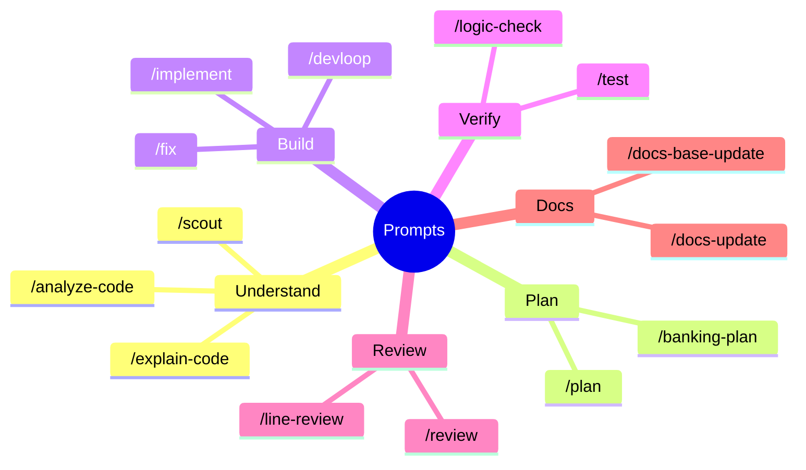
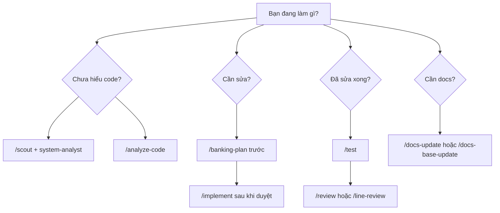

# Quick reference

## Setup commands

| Việc                  | Lệnh                                                       |
| --------------------- | ---------------------------------------------------------- |
| Cài hook local        | `.github\scripts\setup.ps1`                                |
| Cài strict local mode | `.github\scripts\setup.ps1 -Strict`                        |
| Chạy governance check | `.github\scripts\pre-push-governance-check.ps1 -Mode Warn` |

## Prompt map



## Agent map

| Nhu cầu                                  | Agent                |
| ---------------------------------------- | -------------------- |
| Hiểu kiến trúc, dependency, blast radius | `system-analyst`     |
| Lập kế hoạch, phase, risk, rollback      | `planner`            |
| Tìm context, file, symbol                | `researcher`         |
| Chọn check/test, phân tích test fail     | `tester`             |
| Trace bug, root cause, fix tối thiểu     | `debugger`           |
| Review code quality                      | `code-reviewer`      |
| Review security/privacy/audit            | `security-reviewer`  |
| Cập nhật docs/changelog/log              | `docs-manager`       |
| Nghiên cứu kiến trúc có nguồn            | `research-architect` |

## Decision tree



## Good request templates

Analyze:

```text
/analyze-code Hãy đọc flow hiện tại, liệt kê entry point, service, repository, data contract, side effect, test và blast radius.
```

Plan:

```text
/banking-plan Hãy lập plan thay đổi. Bao gồm scope, files, risk, rollback, verification và docs impact. Không implement trước khi tôi duyệt.
```

Review:

```text
/line-review Review từng dòng thay đổi. Ưu tiên security, privacy, data integrity, logging, exception, missing tests và docs impact.
```

Docs:

```text
/docs-base-update Cập nhật docs base, changelog và delivery log cho thay đổi này. Ghi rõ verification, rollback và residual risk.
```

## Safety checklist

- Read before plan.
- Plan before edit.
- Verify before done.
- Review changed lines before summary.
- Update docs after behavior/setup/policy changes.
- Never expose secrets, tokens, PII, account data, card data or production data.
- Never create parallel helpers, serializers, DI/config patterns or logging wrappers before searching existing approved components.

## Must-read files

| File                                            | Vai trò             |
| ----------------------------------------------- | ------------------- |
| `.github/copilot-instructions.md`               | Luật nền always-on  |
| `.github/copilot/blocked-rules.md`              | Rule cấm trung tâm  |
| `.github/copilot/copilot-architecture.md`       | Kiến trúc package   |
| `.github/copilot/workflow-playbook.md`          | Delivery flow       |
| `.github/copilot/agent-catalog.md`              | Agent catalog       |
| `.github/copilot/prompt-catalog.md`             | Prompt catalog      |
| `.github/copilot/skills-index.md`               | Skill catalog       |
| `.github/scripts/pre-push-governance-check.ps1` | Local governance    |
| `.github/docs/project-docs-base.md`             | Technical docs base |
