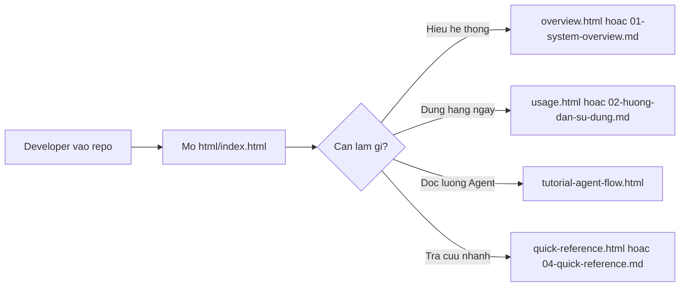

# Introduce - Project AI Usage Guide

Day la cua vao chinh thuc cho bo tai lieu huong dan su dung Project AI trong repository nay. Folder nay chi tap trung vao cach developer doc, hoi, dung prompt/agent/skill, va chay local governance check.

## Mo ban HTML

Mo [html/index.html](html/index.html) de xem ban huong dan HTML. Toan bo HTML nam trong folder rieng `html/`; Markdown van giu o root cua `introduce/` de GitHub va local check doc duoc.

## Bo tai lieu dang dung

| Tai lieu                                                       | Danh cho                       | Dung khi                                                            |
| -------------------------------------------------------------- | ------------------------------ | ------------------------------------------------------------------- |
| [html/index.html](html/index.html)                             | Tat ca nguoi doc               | Can luong doc nhanh ve cach su dung Project AI                      |
| [html/overview.html](html/overview.html)                       | Tech lead, architect, reviewer | Can hieu cau truc Project AI, thanh phan, boundary local-only       |
| [html/usage.html](html/usage.html)                             | Developer                      | Can thao tac hang ngay: hoi AI, chon prompt, chon agent, chay check |
| [html/tutorial-agent-flow.html](html/tutorial-agent-flow.html) | Developer, reviewer            | Can xem luong Agent tu request den plan, implement, verify          |
| [html/quick-reference.html](html/quick-reference.html)         | Developer hang ngay            | Can tra nhanh command, prompt, agent, safety rule                   |
| [01-system-overview.md](01-system-overview.md)                 | Tech lead, architect, reviewer | Can doc Markdown ve tong quan he thong                              |
| [02-huong-dan-su-dung.md](02-huong-dan-su-dung.md)             | Developer                      | Can doc Markdown ve cach dung Project AI                            |
| [04-quick-reference.md](04-quick-reference.md)                 | Developer hang ngay            | Can cheat sheet Markdown                                            |

## Cach doc nhanh



## Nguyen tac su dung Project AI

- Doc scope truoc: Project AI nay la package `.github/`, khong phai application runtime.
- Hoi AI theo viec can lam: plan, analyze, explain, fix, review, test, docs-update.
- Chon agent dung vai: Planner cho plan, System Analyst cho codebase/flow, Code Reviewer/Security Reviewer cho review, Tester cho verification, Docs Manager cho docs.
- Dung skill khi can chuyen mon: banking-grade, system-analysis, secure-code-review, testing-verification, docs-base-maintenance.
- Chay local check truoc khi day thay doi:

```powershell
powershell -NoProfile -ExecutionPolicy Bypass -File .github\scripts\pre-push-governance-check.ps1 -Mode Warn
```

## Gioi han hien tai

- Chi local-only: setup script, local hook, local governance check.
- Khong them PR template, CODEOWNERS, branch protection, GitHub Actions hoac CI/CD enforcement trong giai doan nay.
- Khong dua secret, PII, customer data, card/account data, raw production log vao prompt hoac docs.
- Copilot ho tro phan tich va thuc thi, nhung human review van la buoc quyet dinh cuoi.
